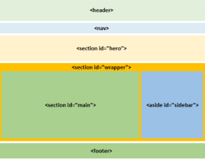
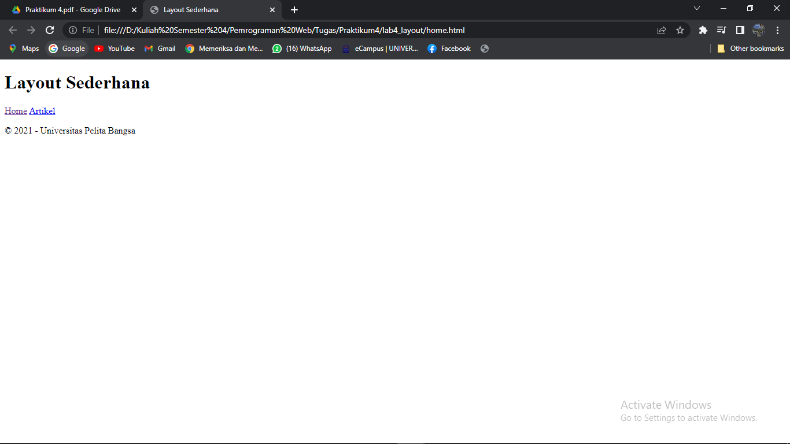
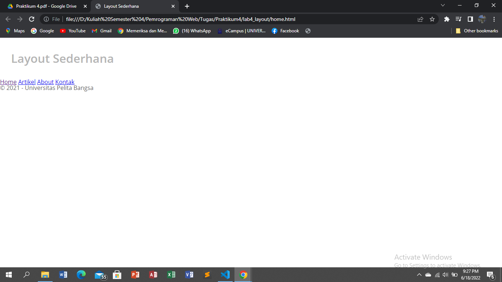
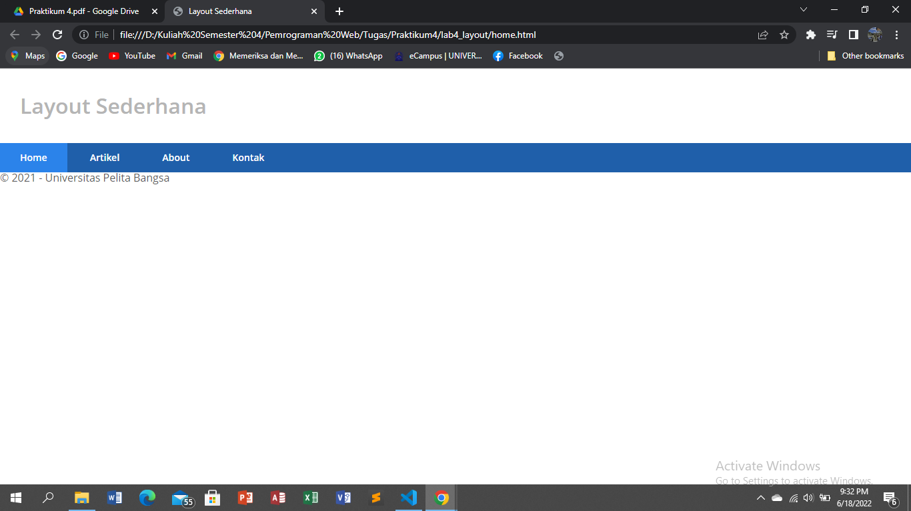
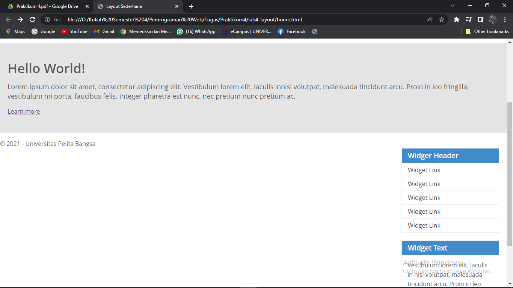
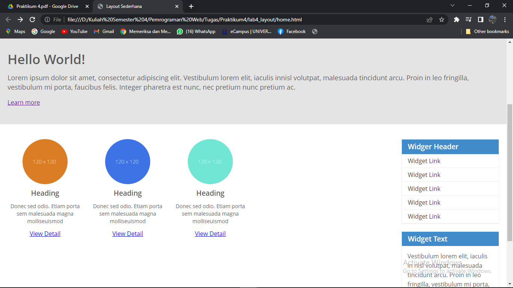
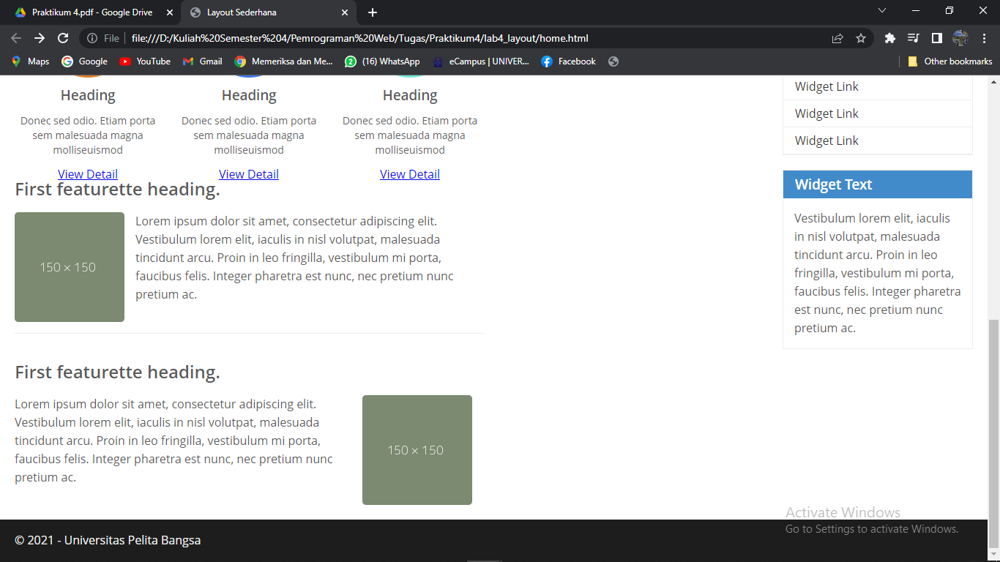
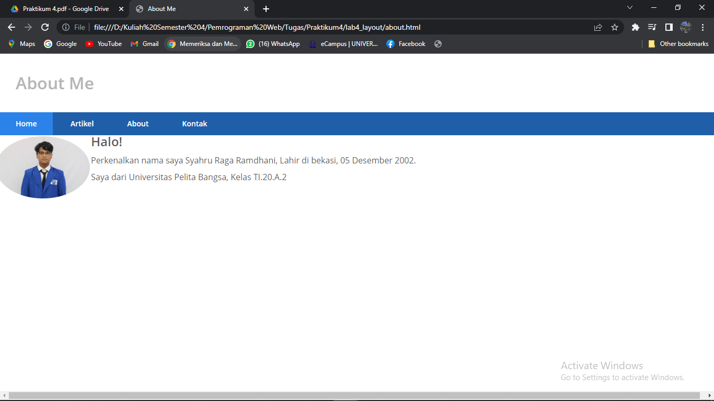
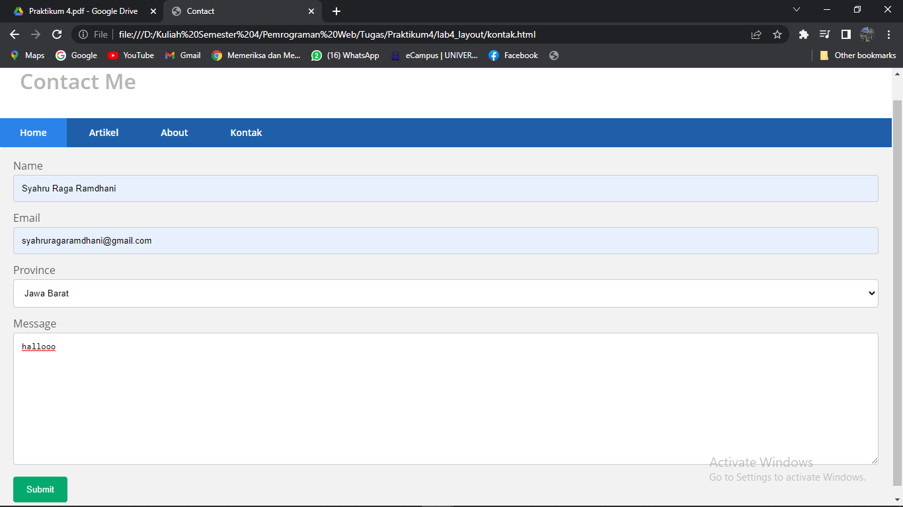

# **Praktikum 4**
  ---------------
|Nama			|Kelas		|NIM		|
|-----			|-----		|-----		|
|Syahru	Raga Ramdhani	|TI.20.A.2	|312010354	|

## **Langkah-Langkah Praktikum**
* **Membuat Box Element**
* Membuat dokumen HTML, seperti berikut.

* Kemudian tambahkan kode untuk membuat box element dengan tag div seperti berikut.</br>

* Selanjutnya tambahkan deklarasi CSS pada head untuk membuat float element, seperti berikut.

* Lalu save untuk melihat hasilnya pada browser.

* Kemudian tambahkan Clearfix untuk mengatur element setelah float element. Property `clear` digunakan untuk mengaturnya. Tambahkan element div lainnya setelah div 3 seperti berikut.

* Kemudian atur property clear pada CSS, seperti berikut.</br>

* lalu save kembali dan refresh pada browser untuk melihat hasilnya.
 </br>

**Membuat Layout Sederhana** <br>
* Buat folder baru, Kemudian buatlah file baru didalamnya dengan nama **home.html**, dan file css dengan nama **style.css**. <br>
* Kemudian isi kode html seperti berikut.<br>
```
<!DOCTYPE html>
<html lang="en">
<head>
    <meta charset="UTF-8">
    <meta name="viewport" content="width=device-width, initial-scale=1.0">
    <title>Layout Sederhana</title>
    <link rel="stylesheet" href="style.css">
</head>
<body>
    <div id="container">

    </div>
</body>
</html>
```
<br>

* Kemudian buat kerangka layout dengan semantics element seperti berikut.<br>

<br>

Kemudian tulis kode berikut.
```
<header>
        <h1>Layout Sederhana</h1>
    </header>
    <nav>
        <a href="home.html" class="active">Home</a>
        <a href="artikel.html">Artikel</a>
        <a href="about.html"About></a>
        <a href="kontak.html"Kontak></a>
    </nav>
    <section id="hero"></section>
    <section id="wrapper">
        <section id="main"></section>
        <aside id="sidebar"></aside>
    </section>
    <footer>
        <p>&copy; 2021 - Universitas Pelita Bangsa</p>
    </footer>
```
<br>

* Kemudian buka browser dan lihat hasilnya. <br>
<br>

* Kemudian tambahkan kode CSS untuk membuat layoutnya. <br>
```
/* import google font */
@import 
url('https://fonts.googleapis.com/css2?family-Open+Sans:ital,wght@0,300;0,400;0,600;0,700;0,800;1,300;1,300;1,400;1,600;1,700;1,800&display=swap');
@import 
url('https://fonts.googleapis.com/css2?family-Open+Sans+Condensed::ital,wght@0,300;0,700;1,300&display=swap');

/* Reset CSS */
* {
    margin: 0;
    padding: 0;
}

body {
    line-height: 1;
    font-size: 100%;
    font-family:'Open Sans', sans-serif;
    color: #5a5a5a;
}

#container {
    width: 980px;
    margin: 0 auto;
    box-shadow: 0 0 1em #cccccc;
}

/* header */
header {
    padding: 20px;
}

header h1 {
    margin: 20px 10px;
    color: #b5b5b5;
}
```
<br>

* Kemudian lihat hasilnya pada browser. <br>
 <br>

* **Membuat Navigasi**
* Kemudian selanjutnya mengatur navigasi.
```
/* navigasi */
nav {
    display: block;
    background-color: #1f5faa;
}

nav a {
    padding: 15px 30px;
    display: inline-block;
    color: #ffffff;
    font-size: 14px;
    text-decoration: none;
    font-weight: bold;
}

nav a.active,
nav a:hover {
    background-color: #2b83ea;
}
```
<br>

* Kemudian lihat hasilnya <br>
 <br>

* **Membuat Hero Panel**
* Selanjutnya membuat hero panel. Tambahkan kode HTML dan CSS seperti berikut. 
```
<section id="hero">
        <h1>Hello World!</h1>
        <p>Lorem ipsum dolor sit amet, consectetur adipiscing elit. Vestibulum lorem
            elit, iaculis innisl volutpat, malesuada tincidunt arcu. Proin in leo fringilla,
            vestibulum mi porta, faucibus felis. Integer pharetra est nunc, nec pretium nunc
            pretium ac.</p>
        <a href="home.html" class="btn btn-large">Learn more & raquo</a>
</section>
```
<br>

```
/* Hero Panel */
#hero {
    background-color: #e4e4e5;
    padding: 50px 20px;
    margin-bottom: 20px;
}

#hero h1 {
    margin-bottom: 20px;
    font-size: 35px;
}

#hero p {
    margin-bottom: 20px;
    font-size: 18px;
    line-height: 25px;
}
```
<br>

* Kemudian selanjutnya refresh browser kembali.<br> 
<br>

* **Mengatur Layout dan Sidebar**
* Selanjutnya mengatur main content dan sidebar, tambahkan CSS float.
```
/* main content */
#wrapper {
    margin: 0;
}

#main {
    float: left;
    width: 640px;
    padding: 20px;
}

/* sidebar area */
#sidebar {
    float: left;
    width: 260px;
    padding: 20px;
}
```
<br>

* **Membuat Sidebar Widget**
* Kemudian selanjutnya menambahkan element lain dalam sidebar.
```
<aside id="sidebar">
        <div class="widget-box">
            <h3 class="title">Widger Header</h3>
            <ul>
                <li><a href="#">Widget Link</a></li>
                <li><a href="#">Widget Link</a></li>
                <li><a href="#">Widget Link</a></li>
                <li><a href="#">Widget Link</a></li>
                <li><a href="#">Widget Link</a></li>
            </ul>
        </div>
        <div class="widget-box">
            <h3 class="title">Widget Text</h3>
            <p>Vestibulum lorem elit, iaculis in nisl volutpat, malesuada tincidunt
                arcu. Proin in leo fringilla, vestibulum mi porta, faucibus felis. Integer
                pharetra est nunc, nec pretium nunc pretium ac.</p>
        </div>
    </aside>
```
<br>

* Kemudian tambahkan CSS <br>
```
/* widget */
.widget-box {
    border: 1px solid #eee;
    margin-bottom: 20px;
}

.widget-box .title {
    padding: 10px 16px;
    background-color: #428bca;
    color: #fff;
}

.widget-box ul {
    list-style-type: none;
}

.widget-box li {
    border-bottom: 1px solid #eee;
}

.widget-box li a {
    padding: 10px 16px;
    color: #333;
    display: block;
    text-decoration: none;
}

.widget-box li:hover a {
    background-color: #eee;
}

.widget-box p {
    padding: 15px;
    line-height: 25px;
}
```
<br>

* Kemudian refresh kembali browser.<Br>
<br>

* **Mengatur Footer**
* Selanjutnya mengatur tampilan footer. Tambahkan CSS untuk footer.<br>
```
/* footer */
footer {
    clear: both;
    background-color: #1d1d1d;
    padding: 20px;
    color: #eee;
}
```
<br>

* Kemudian refresh kembali browser.
<br>

* **Menambahkan Elemen lainnya pada Main Content**
```
<section id="main">
        <div class="row">
            <div class="box">
                
                <h3>Heading</h3>
                <p>Donec sed odio. Etiam porta sem malesuada magna molliseuismod</p>
                <a href="#" class="btn btn-default">View Detail</a>
                </div>
            <div class="box">
                
                <h3>Heading</h3>
                <p>Donec sed odio. Etiam porta sem malesuada magna molliseuismod</p>
                <a href="#" class="btn btn-default">View Detail</a>
            </div>
            <div class="box">
                
                <h3>Heading</h3>
                <p>Donec sed odio. Etiam porta sem malesuada magna molliseuismod</p>
                <a href="#" class="btn btn-default">View Detail</a>
            </div>
        </div>
    </section>
```
<br>

* Kemudian tambahkan CSS.<br>
```
/* box */
.box {
    display: block;
    float: left;
    width:33.333333%;
    box-sizing:border-box;
    -moz-box-sizing:border-box;
    -webkit-box-sizing:border-box;
    padding: 0 10px;
    text-align: center;
}

.box h3 {
    margin: 15px 0;
}

.box p {
    line-height: 20px;
    font-size: 14px;
    margin-bottom: 15px;
}

box img {
    border: 0;
    vertical-align: middle;
}

.image-circle {
    border-radius: 50%;
}

.row {
    margin: 0 -10px;
    box-sizing: border-box;
    -moz-box-sizing: border-box;
    -webkit-box-sizing: border-box;
}

.row:after, .row:before
.entry:after, .entry:before {
    content: '';
    display: table;
}

.row:after,
.entry:after {
    clear: both;
}
```
<br>

* Kemudian refresh kembali browser.<Br>
<br>

* **Menambahkan Content Artikel**
* Selanjutnya membuat content artikel. Tambahkan HTML berikut pada main content.
```
        <hr class="divider" />
        <article class="entry">
            <h2>First featurette heading.</h2>
            
            <p>Lorem ipsum dolor sit amet, consectetur adipiscing elit. Vestibulum lorem
        elit, iaculis in nisl volutpat, malesuada tincidunt arcu. Proin in leo fringilla,
        vestibulum mi porta, faucibus felis. Integer pharetra est nunc, nec pretium nunc
        pretium ac.</p>
        </article>
        <hr class="divider" />
        <article class="entry">
            <h2>First featurette heading.</h2>
            
            <p>Lorem ipsum dolor sit amet, consectetur adipiscing elit. Vestibulum lorem
        elit, iaculis in nisl volutpat, malesuada tincidunt arcu. Proin in leo fringilla,
        vestibulum mi porta, faucibus felis. Integer pharetra est nunc, nec pretium nunc
        pretium ac.</p>
        </article>
```
<br>

* Kemudian tambahkan CSS <br>
```
.divider {
    border: 0;
    border-top: 1px solid #eeeeee;
    margin: 40px 0;
}

/* entry */
.entry {
    margin: 15px 0;
}

.entry h2 {
    margin-bottom: 20px;
}

.entry p {
    line-height: 25px;
}

.entry img {
    float: left;
    border-radius: 5px;
    margin-right: 15px;
}

.entry .right-img {
    float: right;
}
```
<br>

* Kemudian refresh kembali browser.
<br>

## **Pertanyaan dan Tugas**
1. Tambahkan Layout untuk menu About => buat single layout yang berisi deskripsi, portfolio, dll <br>
<br>
Berikut Source Code nya. <br>
```
<!DOCTYPE html>
<html lang="en">
<head>
    <meta charset="UTF-8">
    <meta name="viewport" content="width=device-width, initial-scale=1.0">
    <title>About Me</title>
    <link rel="stylesheet" href="style.css">
</head>
<body>
    <div id="container">
    </div>
    <header>
        <h1>About Me</h1>
    </header>
    <nav>
        <a href="home.html" class="active">Home</a>
        <a href="artikel.html">Artikel</a>
        <a href="about.html">About</a>
        <a href="kontak.html">Kontak</a>
    </nav>
    <section id="Introduce">
        <div class="row">
            
            <h1>Halo!</h1>
            <br>
            <p>Perkenalkan nama saya Syahru Raga Ramdhani, Lahir di bekasi, 05 Desember 2002.</p>
            <br>
            <p>Saya dari Universitas Pelita Bangsa, Kelas TI.20.A.2</p>
        </div>
    </section>
</div>
</body>
</html>
```
2. Tambahkan layout untuk menu Contact => yang berisi form isian: nama, email, message, dll <br>
<br>
Berikut Source Code nya.<br>
```
<!DOCTYPE html>
<html lang="en">
<head>
    <meta charset="UTF-8">
    <meta name="viewport" content="width=device-width, initial-scale=1.0">
    <title>Contact</title>
    <link rel="stylesheet" href="style.css">
</head>
<body>
    <div id="container">
    </div>
    <header>
        <h1>Contact Me</h1>
    </header>
    <nav>
        <a href="home.html" class="active">Home</a>
        <a href="artikel.html">Artikel</a>
        <a href="about.html">About</a>
        <a href="kontak.html">Kontak</a>
    </nav>
    <div class="container">
        <form action="action_page.php">
          <label for="fname">Name</label>
          <input type="text" id="name" name="name" placeholder="Your name..">
          <label for="lname">Email</label>
          <input type="text" id="email" name="email" placeholder="Your email..">      
          <label for="province">Province</label>
          <select id="province" name="province">
            <option value="jabar">Jawa Barat</option>
            <option value="jateng">Jawa Tengah</option>
            <option value="jatim">Jawa Timur</option>
            <option value="kalbar">Kalimantan Barat</option>
            <option value="kaltim">Kalimantan Timur</option>
          </select>
          <label for="subject">Message</label>
          <textarea id="subject" name="message" placeholder="Write something.." style="height:200px"></textarea>
          <input type="submit" value="Submit">      
        </form>
      </div>   
```
